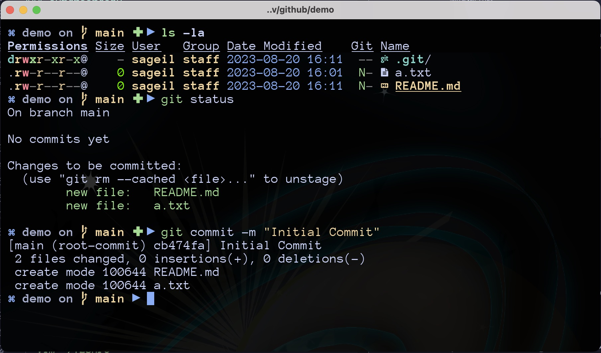

### Saint John's Arms is a minimalistic [oh-my-zsh](https://ohmyz.sh) theme for [z shell](https://www.zsh.org/).

<p align="center">
  
</p>

### Installation

- Using wget

  ```sh
     wget -O $ZSH_CUSTOM/themes/st-johns-arms.zsh-theme https://raw.githubusercontent.com/sageil/saint-johns-arms-zsh-theme/main/st-johns-arms.zsh-theme
  ```

- Using curl

  ```sh
  curl -L -o $ZSH_CUSTOM/themes/st-johns-arms.zsh-theme https://raw.githubusercontent.com/sageil/saint-johns-arms-zsh-theme/main/st-johns-arms.zsh-theme
  ```

- ```sh
   vim ~/.zshrc
  ```

- Set `ZSH_THEME="st-johns-arms" in ~/.zshrc`

- ```sh
   source ~/.zshrc
  ```
